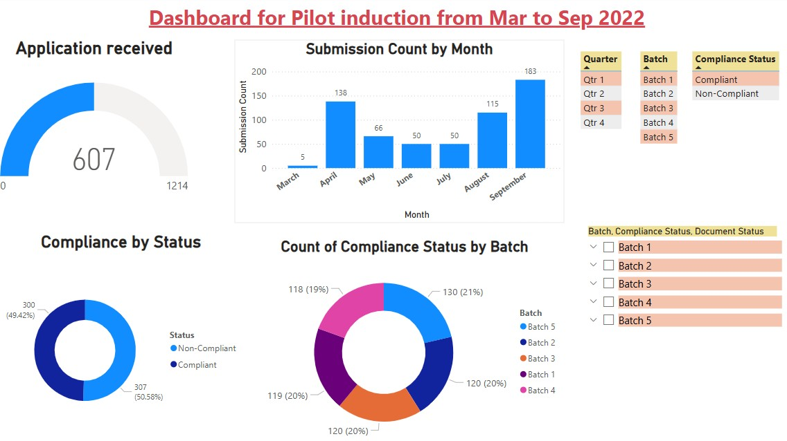

# 4_project_pilot_induction_dashboard 
# Post Covid from Mar to Sep 2022

📊 A Power BI dashboard project to visualize pilot induction & compliance status from March to September 2022.

## Features
- Interactive slicers by Batch, Quarter, Compliance Status
- Submission and License Expiry trends
- Python visuals for compliance insights

## Tools Used
- Power BI
- Python (matplotlib)
- Google Sheets / Excel
- Google API integrated with auto referesh feature

## Preview

## License
MIT
