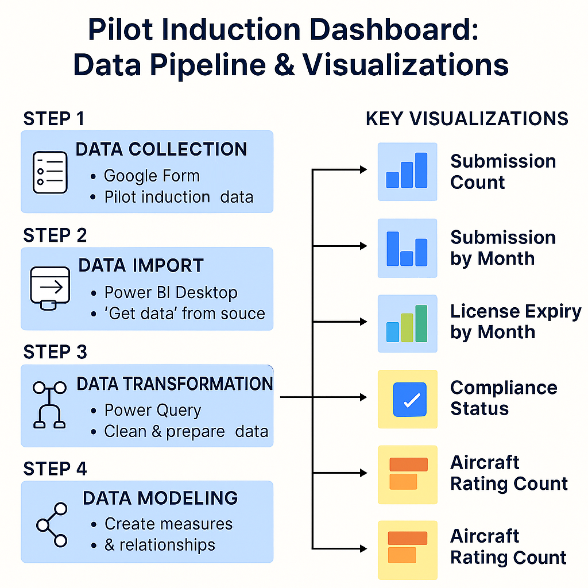
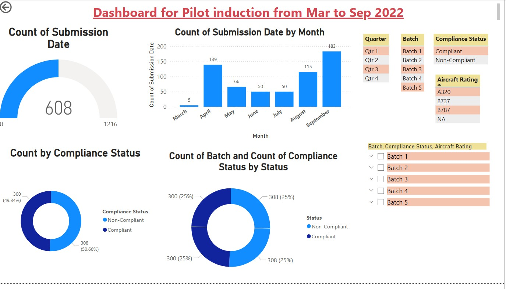
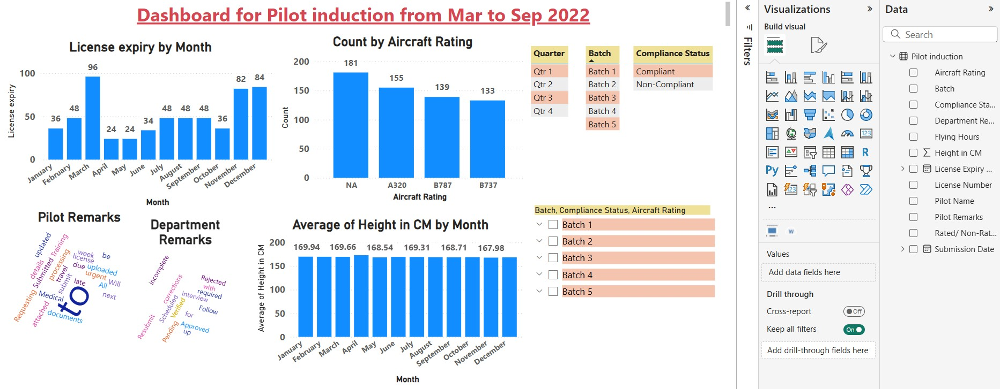
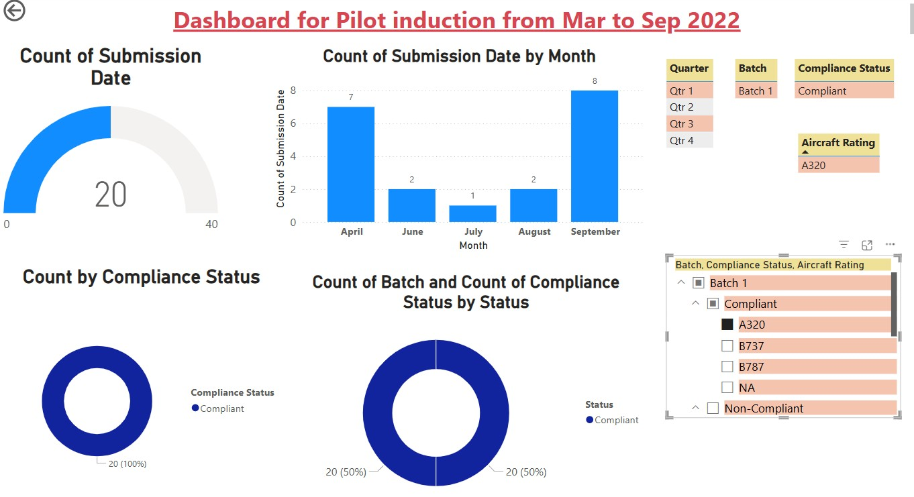
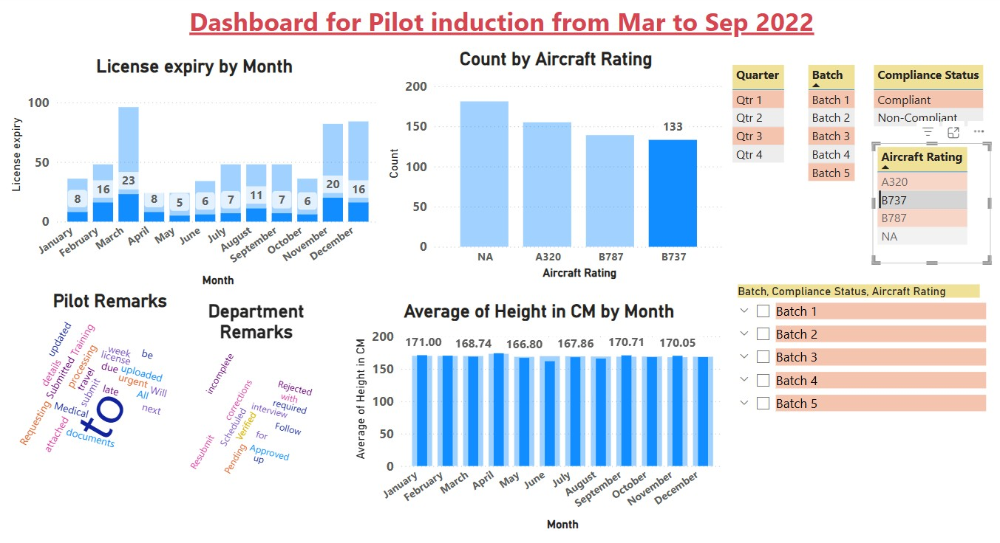
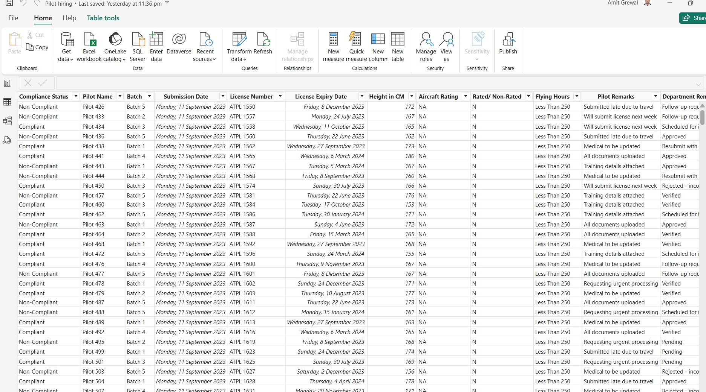

# ✈️ Pilot Induction Dashboard (Mar to Sep 2022)

This Power BI project visualizes and monitors the pilot induction process using key performance indicators (KPIs), compliance tracking, and demographic analysis.

---

## 🎯 Objective

To build an interactive dashboard that:
- Tracks pilot application submissions and license expiries
- Monitors compliance status across batches
- Analyzes pilot demographic trends (e.g., height, aircraft rating, flying hours)
- Helps stakeholders identify risks and optimize induction scheduling

---

## 📁 Data Source

- **File Name**: `Pilot_Induction_Dataset.csv` (Google Sheets/Excel)
- **Fields Used**:  
  - `Pilot Name`, `Batch`, `Submission Date`, `Compliance Status`, `License Number`  
  - `Aircraft Rating`, `Height in CM`, `Flying Hours`, `Rated/Non-Rated`, `Remarks`  

---

## 🔄 Data Pipeline

| Step | Process                         | Tool Used       |
|------|----------------------------------|-----------------|
| 1️⃣   | Data Collection                 | Google Sheets / Excel |
| 2️⃣   | Data Import                     | Power BI Desktop |
| 3️⃣   | Data Transformation             | Power Query Editor (Clean, Format, Extract Month/Year) |
| 4️⃣   | Data Modeling                   | Single-table model, DAX measures, calculated columns |
| 5️⃣   | Dashboard Creation              | Power BI Visuals and Slicers |
| 6️⃣   | Scheduled Refresh (every 15 days) | Power BI Service |

---

## 📊 Key Visualizations

| Visual Type                    | Purpose                                     |
|-------------------------------|---------------------------------------------|
| Gauge                         | Total Submission Count                      |
| Clustered Column Chart        | Submissions by Month                        |
| Pie/Donut Charts              | Compliance Status Breakdown                 |
| Bar Chart                     | License Expiry Trends by Month              |
| Word Cloud                    | Frequent Pilot & Department Remarks         |
| Histogram                     | Average Height per Month                    |
| Slicer Panel                  | Filters by Batch, Quarter, Rating, Status   |

---

## ✅ Outcome: How the Objective Was Achieved

- 🗓️ Mapped monthly submission patterns to highlight peak activity
- 📉 Identified non-compliant pilots using visual breakdowns
- 📏 Analyzed pilot physical readiness and training eligibility
- 📞 Surfaced communication issues through common remarks
- ✈️ Grouped aircraft type proficiency to optimize future flight allocations
- 🔁 Enabled automated updates every 15 days for real-time insights

---

## 📥 Deployment

1. Open `Pilot_Induction_Dashboard.pbix` in Power BI Desktop
2. Replace source with your Google Sheet path 
3. Publish to Power BI Service
4. Set up scheduled refresh (15-day interval via twice-monthly setup)

## 📥 Visualisations
- Data Pipeline
- Dashboard
- Dashboard 2
- A320_rated-Batch
- B737_rated-Batch
- Dataset
- Google sheet_API link

