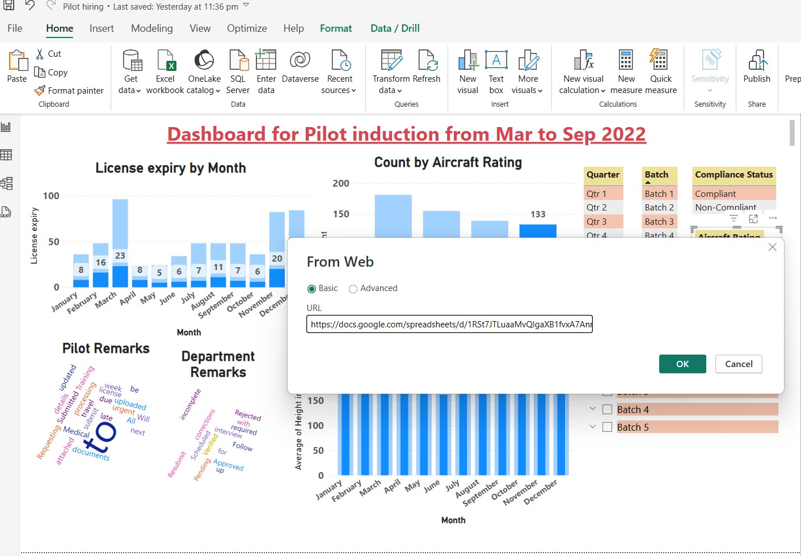

# ✈️ Pilot Induction Dashboard (Mar to Sep 2022)

This Power BI project visualizes real-time pilot induction data collected via Google Forms and maintained in a centralized Google Sheet. The dashboard provides insights into application submissions, license compliance, and pilot readiness across batches.

---

## 🎯 Objective

To create an automated and interactive dashboard that:
- Tracks pilot application submissions and compliance
- Monitors license expiry timelines
- Analyzes pilot demographics (height, aircraft rating, flying hours)
- Assists management in scheduling, follow-ups, and risk identification

---

## 📁 Data Source & Flow

- **Step 1**: Pilots submit induction details through a **Google Form**
- **Step 2**: Form responses are automatically stored in a linked **Google Sheet**
- **Step 3**: Google Sheet is connected to **Power BI** via web link
- **Step 4**: Data is cleaned, transformed, and visualized in Power BI
- **Step 5**: Scheduled refresh is enabled every 15 days via Power BI Service

---

## 🔄 Data Pipeline

| Step | Process                         | Tool Used          |
|------|----------------------------------|--------------------|
| 1️⃣   | Data Collection via Form       | Google Forms       |
| 2️⃣   | Data Storage                   | Google Sheets      |
| 3️⃣   | Data Import                    | Power BI Web Connector |
| 4️⃣   | Data Transformation            | Power Query Editor |
| 5️⃣   | Visualization & Modelling     | Power BI Desktop   |
| 6️⃣   | Auto Refresh (15-Day Interval) | Power BI Service   |

---

## 📊 Key Visualizations

| Visual Type               | Purpose                                                |
|---------------------------|--------------------------------------------------------|
| KPI Cards                 | Total Submissions, % Rated, Avg Flying Hours           |
| Line & Bar Charts         | Submission Trends, License Expiry by Month             |
| Pie / Donut Charts        | Compliance Status Breakdown                            |
| Word Clouds               | Frequent Pilot & Department Remarks                    |
| Histograms / Box Plots    | Height Distribution                                    |
| Tables with Conditional Formatting | View pilot-level info, flag risk or expiry       |
| Slicers                   | Filter by Batch, Rating, Compliance, Month             |

---

## ✅ Achievements

- 🧾 Seamless data collection from 600+ pilots via Google Forms
- 📊 Real-time insights through connected Google Sheet + Power BI integration
- 📉 Identified non-compliance cases and expiring licenses at a glance
- 📈 Highlighted patterns in training readiness, batch performance, and ratings
- 🔁 Enabled semi-monthly auto-refresh for up-to-date decision support

---

## 🧰 Tools & Technologies

- **Google Forms** – Front-end for pilot submissions  
- **Google Sheets** – Real-time data aggregation  
- **Power BI Desktop** – Data modeling, transformation, and visualization  
- **Power BI Service** – Publishing & auto-refresh scheduling  

---

## 🚀 Deployment Instructions

1. Link your Power BI report to the Google Sheet via Web > CSV export link  
2. Open `Pilot_Induction_Dashboard.pbix` and refresh the data  
3. Publish to Power BI Service  
4. Under Dataset Settings → Schedule refresh → Set twice-monthly refresh

## 📥 Visualisations
- Data Pipeline
- Dashboard
- Dashboard 2
- A320_rated-Batch
- B737_rated-Batch
- Dataset
- Google sheet_API link 

